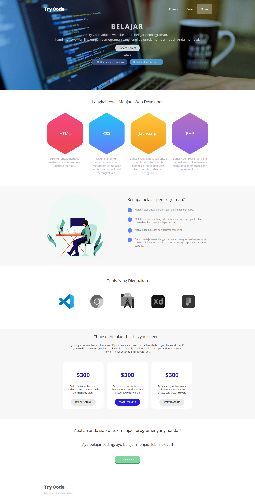

# Online Course

> Created by Agung Firmansyah

Repository Website Design with Online Course Themes, designs are built with HTML, CSS, and Javascript.

I build with from zero and improve my knowledge about Web Design, next I will build an Web App with library.

## List Home Landing Page

- Header
- Lessons
- Why Should Join
- Price Plan
- Tools
- Join
- Footer

